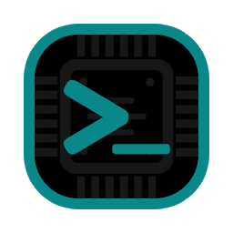

# HyxTerminal

<p align="center">
  
</p>

<p align="center">
  <b>A modern, customizable GTK-based terminal emulator written in Python</b>
</p>

<p align="center">
  <i>Power. Flexibility. Simplicity.</i>
</p>

## About HyxTerminal

HyxTerminal is a feature-rich terminal emulator designed for modern workflows. It combines the power of a traditional terminal with innovative features that enhance productivity. With its sleek interface and customizable options, HyxTerminal delivers an exceptional terminal experience for developers, system administrators, and power users.

## Features

- **Advanced Tab Management**
  - Multiple tabs with drag-and-drop reordering
  - Split terminals (horizontal and vertical)
  - Custom layouts with quad-terminal support
  
- **Smart Features**
  - Command auto-completion hints
  - Command palette for quick access to functions
  - Clipboard manager with history
  
- **Modern Interface**
  - Customizable appearance (themes, colors, opacity)
  - Configurable fonts and cursor styles
  - Fullscreen mode and menubar toggle
  
- **Developer-Friendly**
  - Plugin support for extended functionality
  - Configurable scrollback buffer
  - Full Unicode support
  - Comprehensive keyboard shortcuts

## Requirements

- Python 3.x
- GTK 3.0
- VTE 2.91
- PyGObject

## Installation

1. Install the required dependencies:

```bash
# Ubuntu/Debian
sudo apt-get install python3 python3-gi gir1.2-gtk-3.0 gir1.2-vte-2.91

# Fedora
sudo dnf install python3 python3-gobject gtk3 vte291
```

2. Clone the repository:

```bash
git clone https://github.com/yourusername/hyxterminal.git
cd hyxterminal
```

3. Run the terminal:

```bash
python3 hyxterminal.py
```

## Keyboard Shortcuts

- `Ctrl+Shift+T`: New tab
- `Ctrl+Shift+C`: Copy selected text
- `Ctrl+Shift+V`: Paste from clipboard

## Configuration

Configuration is stored in `~/.config/hyxterminal/config.json`. Settings include:

- Window dimensions
- Font family and size
- Colors and opacity
- Scrollback buffer size
- Cursor shape

## Features

- Tab Management
  - Create/close tabs
  - Reorder tabs via drag and drop
  - Double-click tab to rename
  
- Appearance
  - Customizable background opacity
  - Configurable font and size
  - Adjustable color scheme
  
- Terminal Features
  - Command auto-completion hints
  - Configurable scrollback buffer
  - Multiple cursor shapes
  - Copy/paste support

## Contributing

Contributions are welcome! Please feel free to submit a Pull Request.

## License

This project is licensed under the MIT License - see the LICENSE file for details.
